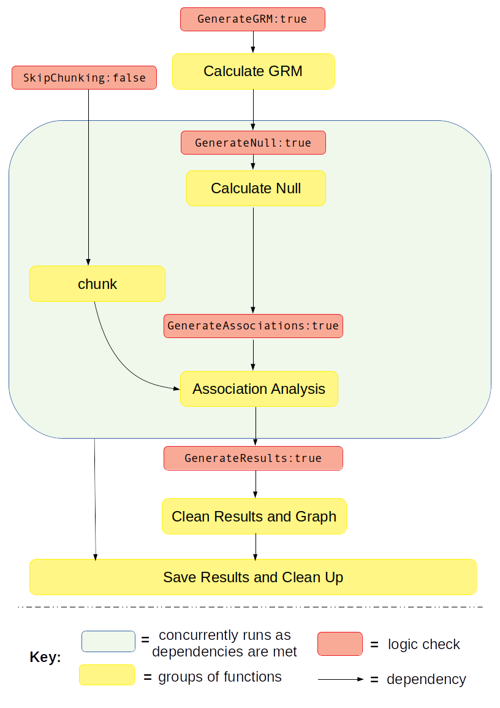

Example Work Flows
===================

Quick Start Command
^^^^^^^^^^^^^^^^^^^

In order to run the pipeline, open a shell or bash prompt (or batch script for a job-scheduler) and type:

.. code-block:: bash 

	$ ./CCPM_GWAS_pipeline myConfigFile.txt 

Example: Full Pipeline with Binary Trait
^^^^^^^^^^^^^^^^^^^^^^^^^^^^^^^^^^^^^^^^
This example will walk you through how to run the full pipeline when the phenotype for association analysis if for a binary trait.  It will guide you through how to properly set the logic, remind you to set the environment, list all the additional files you need, and finally which user parameters need to be set.

Section: Full Pipeline Logic and Overview
------------------------------------------
**Full pipline** means you want to run every component of the pipeline from beginning to end in one go, without re-using any previously calculated data from the pipeline.  This is analagous to setting the pipeline logic kewords to the following: :: 	

	GenerateGRM:true
	GenerateNull:true
	GenerateAssociations:true
	GenerateResults:true
	SkipChunking:false

If the pipeline is set to the above logic, the following workflow will be executed:

Section: Full Pipeline with Binary Trait Step-by-Step Tutorial
---------------------------------------------------------------

STEP 1: Set the logic
~~~~~~~~~~~~~~~~~~~~~

As stated about above, open your config file (.txt) and make sure the logic is set to the following: :: 

	GenerateGRM:true
	GenerateNull:true
	GenerateAssociations:true
	GenerateResults:true
	SkipChunking:false

STEP 2: Set the environment
~~~~~~~~~~~~~~~~~~~~~~~~~~~

Open your config file (.txt) and make sure you set the path to where the bind point, temp bind point, and  container image are located.  I suggest you set the :code:`BindPoint` keyword to the same path as where the container is located to avoid any confusion.  If you have a tmp directory you want to use as scratch space, set that path as well.  If this doesn't exist or you choose not to use it, set the keyword :code:`BindPointTemp` to be the same as the path listed in the keyword :code:`BindPoint`. :: 

	BindPoint:/path/to/bind/container
	BindPointTemp:/path/to/tmp/
	Container:/path/to/SAIGE_v0.39_CCPM_biobank_singularity_recipe_file_11162020.simg

STEP 3: Ensure you have all the files required
~~~~~~~~~~~~~~~~~~~~~~~~~~~~~~~~~~~~~~~~~~~~~~~

For running the full pipeline, including chunking the imputation files, you will need access to the following files:

#. **LD-pruned plink file**
	* used for when logic parameters :code:`GenerateGRM` is set to true and/or :code:`GenerateNull` is set to true.
	* fulfills parameter :code:`Plink`
	* see :ref:`Plink-File-Format` for formatting

#. **phenotype and covariates file**
	* used for when logic parameter :code:`GenerateNull` is set to true
	* fulfills parameter :code:`PhenoFile`
	* see :ref:`Phenotype-File-Format` for formatting

#. **chromosome lengths file**
	* used for when logic parameter, :code:`SkipChunking` is set to true. 
	* fulfills parameter :code:`ChromosomeLengthFile`
	* see :ref:`Chromosome-Length-File-Format` for formatting

#. **imputation files properly named and formatted or genotype files formatted in same way as imputation files**
	* used for when logic paramters :code:`SkipChunking` is set to true and/or :code:`GenerateAssociations` is set to true.
	* fulfills parameter :code:`ImputeSuffix`
	* see :ref:`Imputation-Name-Format` for formatting

#. **SNP information file**
	* use for when logic parameter :code:`GenerateResults` is set to true
	* fulfills parameter :code: `InfoFile`
	* see :ref:`Info-File-Format` for formatting

.. seealso::

	For a complete list of files and name formatting of keyword values listed in the config file see :doc:`Formatting the Required Files <fileFormats>`.

STEP 4: Set the path and values to all the required input parameters
~~~~~~~~~~~~~~~~~~~~~~~~~~~~~~~~~~~~~~~~~~~~~~~~~~~~~~~~~~~~~~~~~~~~~
Now that you have all the required files, it is time to set the values and locations within your config file using the keywords expected.  Here are the required keywords and how to specify them:  

#. This :code:`RUNTYPE` parameter need to just be here for placeholder purposes, however it is required.  It has no impact on the pipeline, except as a header to check that it exists. :: 

	RUNTYPE:FULL

#. The next set of parameters are the keywords that relate to file inputs: 

	.. image:: images/fullPipeline_fileparamters.png
		:width: 700
		:align: center

#. Here are some required general keyword parameters that need to be set:

	.. image:: images/fullPipeline_generalParameter.png
		:width: 700
		:align: center

#. The following two sets of keyword parameters affect the GRM step, i.e. :code:`GenerateGRM:true` :
	
	.. image:: images/fullPipeline_grmParametres.png
		:width: 700
		:align: center

#. The following sets of keyword parameters affect the null model step, i.e. :code:`GenerateNull:true` :

#. The following sets of keyword parameters affect the association analysis step, i.e. :code:`GenerateAssociations:true` :

#. The following sets of keyword parameters affect the results step, i.e. :code:`GenerateResults:true` :

#. These parameters I recommend you keep as is, unless you are familiar with the pipeline and have a reason to change them:

#. For running the full pipeline, these are the **parameters you can ignore**.  You can leave the keywords empty or fill them in, but just know no matter what is listed for these keywords, **the pipeline will ignore them**.

STEP 5: Running the pipeline
~~~~~~~~~~~~~~~~~~~~~~~~~~~~~

STEP 6: Generated Output
~~~~~~~~~~~~~~~~~~~~~~~~~

Example: GRM only
^^^^^^^^^^^^^^^^^^
Section: GRM only Logic and Overview
-------------------------------------
**GRM only** means you want to run the GRM step.  This is analagous to setting the pipeline logic kewords to the following: 

*Note,* :code:`SkipChunking` *can be set to either* :code:`true` *or* :code:`false` *because it is only used if* :code:`GenerateAssociation` *is set to* :code:`true`. :: 	

	GenerateGRM:true
	GenerateNull:false
	GenerateAssociations:false
	GenerateResults:false
	SkipChunking:false

Example: Null Model only
^^^^^^^^^^^^^^^^^^^^^^^^
Section: Null Model Only Logic
-------------------------------
**Null Model only** means you want to run the Null Model only.  It makes an assumption that you already have the GRM pre-calculated and want to re-use it in this step by setting the keywords :code:`SparseGRM` and :code:`SampleIDFile` located in the config file.  These two files are the result of running :code:`GenerateGRM:true`.

Choosing to run just the null model generation step is analagous to setting the pipeline logic kewords to the following: :: 	

	GenerateGRM:false
	GenerateNull:true
	GenerateAssociations:false
	GenerateResults:false
	SkipChunking:false

:code:`SkipChunking` *can be set to either* :code:`true` *or* :code:`false` *because it is only used if* :code:`GenerateAssociation` *is set to* :code:`true`. 

Example: Association Analysis Only
^^^^^^^^^^^^^^^^^^^^^^^^^^^^^^^^^^^
Section: Association Analysis Only Logic
-----------------------------------------
**Association Analysis only** means you only want to run the association anlysis.  It makes an assumption that you already have the null model file (.rda) pre-calculated and have a pre-calculate variance ratio file (.varianceRatio.txt) and want to re-use/use it in this step by setting the keywords :code:`NullModelFile` and :code:`VarianceRatioFile` located in the config file.  These two files are the result of running :code:`GenerateNull:true`.

Choosing to run just the association analysis step is analagous to setting the pipeline logic kewords to the following: :: 	

	GenerateGRM:false
	GenerateNull:false
	GenerateAssociations:true
	GenerateResults:false

When :code:`GenerateAssociations:true`, the :code:`SkipChunking` logic comes into play.

.. note::
	This step produces the raw associaions results concatenated into a file.  It does not clean up the data, perform the proper flips, or generate graphs/figures.  If you want the raw data in addition to the previously mentioned actions, be sure to also set :code:`GenerateResults:true`.

Example: Results and Graphs Only
^^^^^^^^^^^^^^^^^^^^^^^^^^^^^^^^^
Section: Results and Graphs Only Logic
----------------------------------------
**Results and Graphs Only** cleans up raw data that was previously generated from an association analysis and generates cleaned data in addition to some figures/graphs.  You can use any association analysis here as long as it meets the file formatting specifications for supplying results in :code:`AssociationFile`.

Section: Results and Graphs Only Config File
---------------------------------------------

Section: Results and Graphs Only Output
----------------------------------------

Example: Reuse Previously Indexed and Chunked Files
^^^^^^^^^^^^^^^^^^^^^^^^^^^^^^^^^^^^^^^^^^^^^^^^^^^^
Section: Reuse Previously Indexed and Chunked Files Logic
----------------------------------------------------------

Section: Reuse Previously Indexed and Chunked Files Config File
----------------------------------------------------------------

Section: Reuse Previously Indexed and Chunked Files Output
-----------------------------------------------------------

Example: Combinations of Logic
^^^^^^^^^^^^^^^^^^^^^^^^^^^^^^^
Section: Combinations of Logic Logic
-------------------------------------

Section: Combinations of Logic Config File
-------------------------------------------

Section: Combinations of Logic Output
--------------------------------------