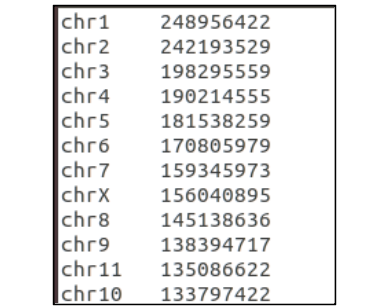
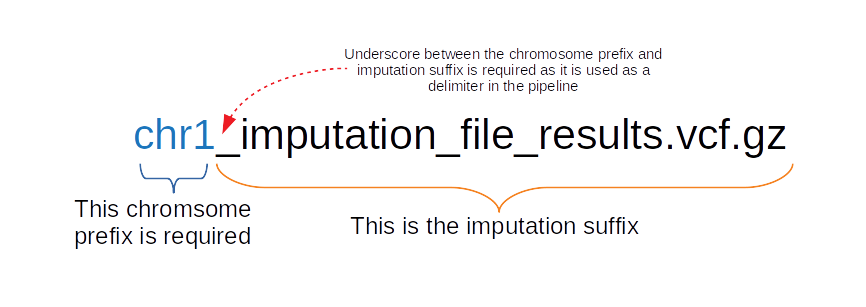
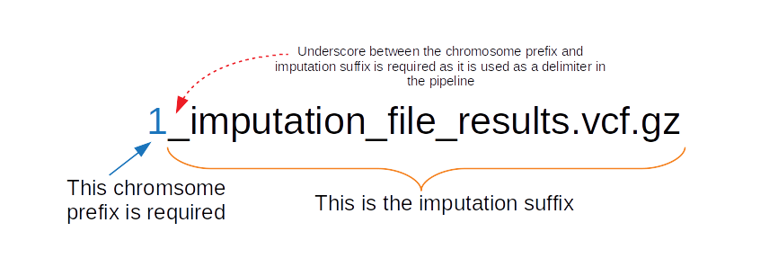
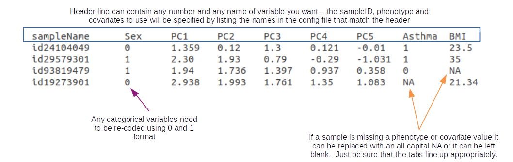
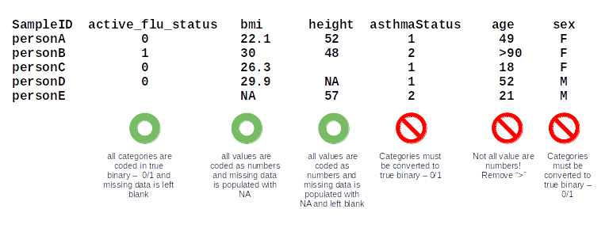
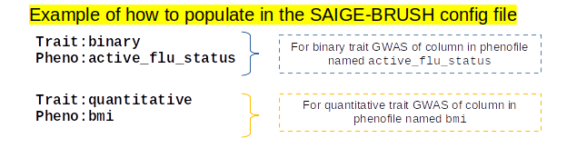
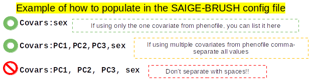
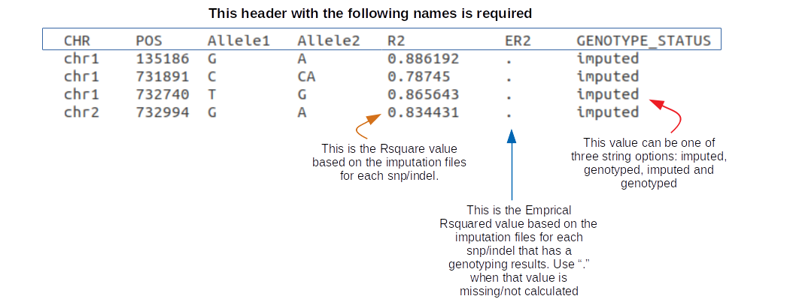

Formatting the Required Files
==============================

The pipeline does require some formatting for file names and contents within files to be present.  This section explains the file format expectations, as well as file name expectations.

.. _Chromosome-Length-File-Format: 

Parameter: ChromosomeLengthFile
^^^^^^^^^^^^^^^^^^^^^^^^^^^^^^^^
The :code:`ChromsomeLengthFile` parameter is a file that can be downloaded and modified from sources such as `NCBI`_ and `UCSC`_.  It should be a tab-delimted file with chromosomes 1-22 listed in the first column and the length of the chromosome in the second column. This file contains **no header**.  The build you select should be based upon the build used for your imputation file.  If only using genotyping file, base this file on the genotype build.

.. _UCSC: http://hgdownload.cse.ucsc.edu/goldenpath/hg38/bigZips/hg38.chrom.sizes
.. _NCBI: https://www.ncbi.nlm.nih.gov/grc/human/data/

.. sidebar:: **Example snippet for hg38**
	
	* 1st column is chromosome
	* 2nd column is length

.. warning:: **hg19 vs hg38 formatting**  Depending on the build you choose you must format your file accordingly.

	- *hg19:* omit "chr" and should strictly be integer values between 1-22 for the first column.
	- *hg38:* include the preceding "chr" string (no spaces) for integer values between 1-22 for the first column.

.. _Imputation-Name-Format: 

Parameter: ImputeSuffix
^^^^^^^^^^^^^^^^^^^^^^^^
This string is the suffix of your imputation file.  The imputation files require to be named and split in a particular way.  

First, all imputation files follow these rules:  
	* split by chromosome
	* sample names are the samples names used in :code:`GenerateGRM` and :code:`GenerateNull` (order doesn't need to be maintained)
	* gzipped vcf files, and 
	* have the matching tabix index ending in the imputation file name followed by the .tbi string

This is how each imputation file needs to be named:

**for hg38**

**for hg19**

.. warning:: **hg19 vs hg38 formatting**  Depending on the build you choose you must format your file name accordingly.

	- *hg19:* omit "chr" and strictly be integer values between 1-22 as the prefix, followed by a required underscore, following by remaining string.
	- *hg38:* include the preceding "chr" string (no spaces) for integer values between 1-22 as the prefix, followed by a required underscore, following by remaining string.

.. _Phenotype-File-Format:

Parameter: PhenoFile
^^^^^^^^^^^^^^^^^^^^^
This is tab-delimited txt file that contains all the sample IDs (must be the same IDs used in the plink file, imputation file, GRM, and null model -- order agnostic).  In addition to the sample IDs, it also contains any phenotype(s) you may want to run and any covariates you may want to use, although the user is not required to use everything listed in the header/file.

Below is an example of a tab-delimited :code:`PhenoFile`.  Again, none of these header names are required, however, there needs to be a header variable at minimum that denotes the sample ID and a phenotype to analyze.

.. note:: It is worthwhile to generate a single PhenoFile that contains many phenotypes and covariates you may want to analyze for the sample set.  Within the config file, the user can specify which single phenotype to run and which covariates to run.  That way, the user can run several jobs in parallel using the same PhenoFile but just changing the trait, phenotype, covariates, and invNorm parameters without having to change anything else.  

.. _Plink-File-Format:

Parameter: Plink
^^^^^^^^^^^^^^^^
`Plink`_ is a software tool that produces a commonly used format for storing genotype/variant data, is generally computationally inexpensive and can be converted easily between common genotype formats such as vcf, bgen, on-binary plinks (.ped/.map) etc. For SAIGE-BRUSH, we recommend the following:
	#. Convert your genotyped data for use in either GRM or null model steps into binary plink format (i.e., these are 3 files that have the suffix, `.bed`_, `.bim`_, `.fam`_)  
		For example if your dataset is called :code:`myInputGenoData`, then you will have 3 plink files: 
        	
    		* myInputGenoData.bed
        	* myInputGenoData.bim
        	* myInputGenoData.fam
	
	#. LD-prune this set along with adding a minor allele frequency threshold using plink.  For example, if you wanted to LD-prune and apply a minor-allele frequency of 5%, you would do this: ::  

			plink --bfile myInputGenoData --indep 50kb 5 2 --maf 0.05  --make-bed --out myNewLDdata
	
	#.  The file is ready and the path and the prefix can be included in the config file for the :code:`Plink` parameter:

	.. image:: images/plink_file_explanation.png
	   :width: 800

.. warning:: **Sample Name Formatting**  The sample names/IDs in the plink file must be exactly the same as in the association files and throughout the entire analysis!!  

.. _Plink: https://www.cog-genomics.org/plink/1.9/
.. _.bed: https://www.cog-genomics.org/plink/1.9/formats#bed
.. _.bim: https://www.cog-genomics.org/plink/1.9/formats#bim
.. _.fam: https://www.cog-genomics.org/plink/1.9/formats#fam

.. _Pheno-Format:  

Parameter: Pheno
^^^^^^^^^^^^^^^^^
The :code:`Pheno` parameter refers to a column name that exists in the :code:`PhenoFile`.  There are a few rules you must follow to format your phenotype columns:  

*  For binary phenotypes, they **must be coded in true binary format** (0 or 1 for control and cases)  
*  For quantitative phenotypes, be sure **all values are numeric** (no >, <, = symbols)  
*  If a value is missing, it can be listed as NA or leave the position blank and tab-over to the next column in the :code:`PhenoFile`.  
*  You can list as many phenotype columns as you would like in the :code:`PhenoFile` and re-use the file for another analysis.
*  The :code:`Pheno` parameter **can only take in one phenotype per analysis run!**  Only the phenotype listed will have the analysis performed.  All other phenotype columns in the :code:`PhenoFile` will be ignored.  

Here are some examples of phenotype columns that are both formatted correctly and incorrectly to illustrate some common pitfalls:  

Here is an example of how to fill out the phenotype and trait information in the config file:  

.. seealso::

	For more information on formatting the :code:`PhenoFile` see :ref:`Phenotype-File-Format`.

.. _Covars-Format:  

Parameter: Covars
^^^^^^^^^^^^^^^^^^
Unlike the :code:`Pheno` parameter, the :code:`Covars` parameters can take in a comma-separted list of covariates you want to use in your analysis, as long as it meets the following requirements:  

*  Follows the same formatting conventions and rules as the :code:`Pheno` and :code:`PhenoFile` parameters and files  
*  Covariate name(s) must be present in the :code:`PhenoFile` tab-delimited file  
*  If using more than 1 covariate, it must be a comma-separted list with **no spaces**  
  
Here is an example of how to fill out the parameter :code:`Covars` in the config file:  

.. seealso::

	For more information on formatting the :code:`PhenoFile` see :ref:`Phenotype-File-Format`.  For formatting conventions see :ref:`Pheno-Format`.

.. _SampleName-Format:  

Parameter: SampleID
^^^^^^^^^^^^^^^^^^^

.. _Info-File-Format:

Parameter: InfoFile
^^^^^^^^^^^^^^^^^^^^
This is a tab-delimited file that contains information about all snps present in the genotyping chip and imputation files.  This file is really only necessary if :code:`GenerateResults:` is set to :code:`true`.

The following headers must be present:
	* CHR
	* POS
	* Allele1
	* Allele2
	* R2
	* ER2
	* GENOTYPE_STATUS

.. _Pre-Chunked-Imputation-File-List-Format:

Parameter: ImputationFileList
^^^^^^^^^^^^^^^^^^^^^^^^^^^^^^
.. _SparseGRM-File-Format:

Parameter: SparseGRM
^^^^^^^^^^^^^^^^^^^^^

.. _SampleID-File-Format:

Parameter: SampleIDFile
^^^^^^^^^^^^^^^^^^^^^^^^

.. _Null-Model-File-Format:

Parameter: NullModelFile
^^^^^^^^^^^^^^^^^^^^^^^^^

.. _VarianceRatio-File-Format:

Parameter: VarianceRatioFile
^^^^^^^^^^^^^^^^^^^^^^^^^^^^^

.. _Assoc-File-Format:  

Parameter: AssociationFile
^^^^^^^^^^^^^^^^^^^^^^^^^^^
