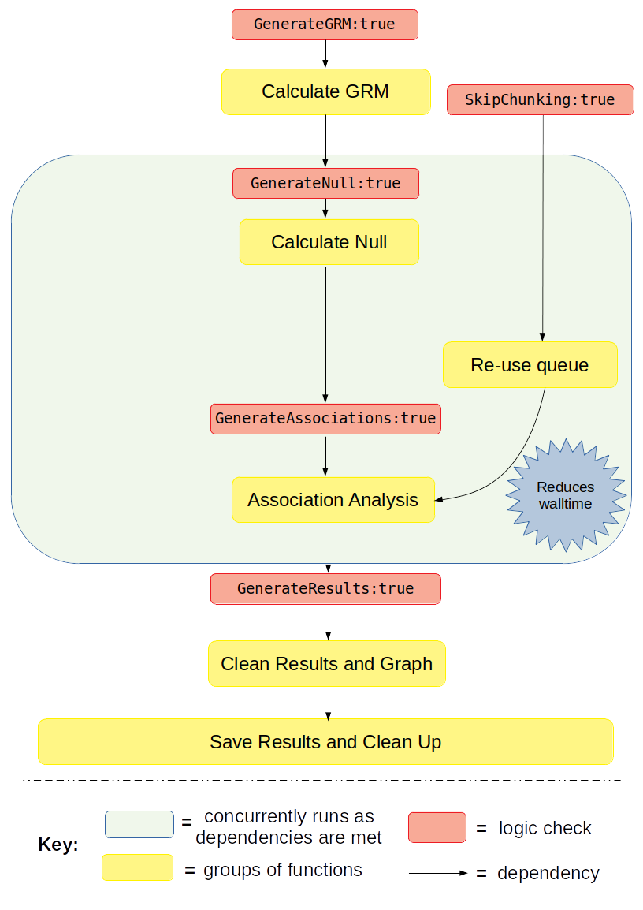

Tutorial: Full Pipeline with Binary Trait - Re-use Previously Chunked Imputation Files
========================================================================================

This example will walk you through how to run the full pipeline when the phenotype for association analysis if for a binary trait.  It will guide you through how to properly set the logic, remind you to set the environment, list all the additional files you need, and finally which user parameters need to be set.

Section: Logic and Overview
----------------------------
**Full pipline with Re-Use Previously Chunked Imputation Files** means you want to run every component of the pipeline from beginning to end in one go, while re-using the previous set of imputation files that were chunked from a previous analysis.  This is analagous to setting the pipeline logic kewords to the following: :: 	

	GenerateGRM:true
	GenerateNull:true
	GenerateAssociations:true
	GenerateResults:true
	SkipChunking:true

If the pipeline is set to the above logic, the following workflow will be executed:

