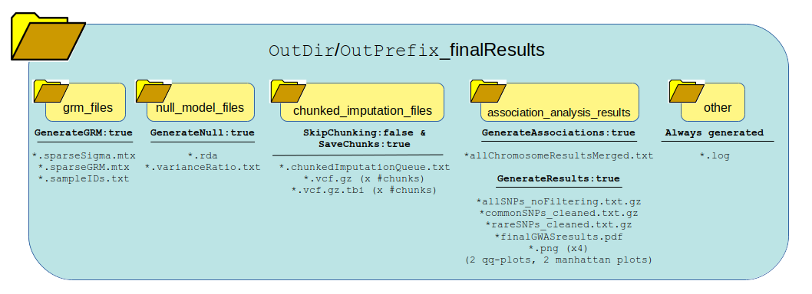
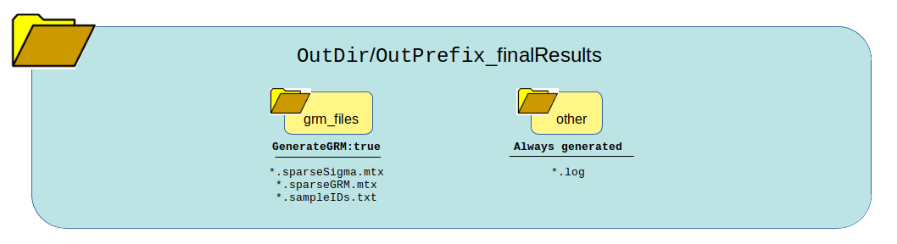
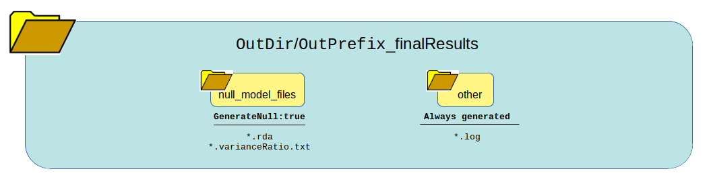
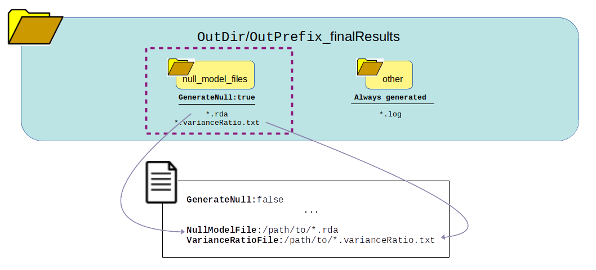

Output Generated
=================

This summarizes the expected output depending on how the pipeline logic boolean values are set in the config file.

Full Pipeline with Chunking
^^^^^^^^^^^^^^^^^^^^^^^^^^^^
Setting this logic:  ::  

    GenerateGRM:true
    GenerateNull:true
    GenerateAssociations:true
    GenerateResults:true
    SkipChunking:false
    SaveChunks:true

Returns this output:  

What can be reused?

Genetic Relatedness Matrix (GRM) only
^^^^^^^^^^^^^^^^^^^^^^^^^^^^^^^^^^^^^^
Setting this logic:  ::  

    GenerateGRM:true
    GenerateNull:false
    GenerateAssociations:false
    GenerateResults:false  
    SkipChunking:false  

Returns this output:  

What can be reused?

.. image:: images/grmOnly_output_results_nextSteps.png
   :width: 1000
   :align: center

Null Model only
^^^^^^^^^^^^^^^^
Setting this logic:  ::  

    GenerateGRM:false
    GenerateNull:true
    GenerateAssociations:false
    GenerateResults:false
    SkipChunking:false  

Returns this output:  

What can be reused?

Association Analysis only
^^^^^^^^^^^^^^^^^^^^^^^^^
Setting this logic (see :ref:`Option_A`):  ::  

    GenerateGRM:false
    GenerateNull:false
    GenerateAssociations:true
    GenerateResults:false
    SkipChunking:false
    SaveChunks:true  

Returns this output:  

What can be reused?

 Setting this logic (see :ref:`Option_B`):  ::  
 
    GenerateGRM:false
    GenerateNull:false
    GenerateAssociations:true
    GenerateResults:false  
    SkipChunking:true  

    
Returns this output:  

What can be reused?

