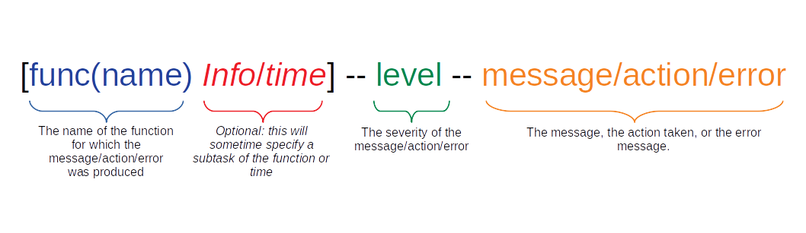

Parsing Through StdErr and StdOut
==================================

When using the pipeline with the container and go binary file, all standard out messages and errors are reported in the generated log file.  It is important to note, that since the pipeline automatically runs steps concurrently when possible, the order of the log files may show some steps running as dependencies become available and based on the threads available.  Also, this standard out is used by SAIGE as well, so anything that does not follow the format below is a results of the software calculations generated by SAIGE, and not the pipeline.

The following shows how messages are formatted in the log output:

Logging Levels
^^^^^^^^^^^^^^^
There are 4 different levels or types of debugging and error handling.  Some are meant to inform, while other are meant to stop the pipeline if an error occurs that cannot be resolved.

===========	===================================================================================
   Level   										Interpretation
===========	===================================================================================
  UPDATE!	To inform the user of the status of the pipeline.
 CONFIRMED!	To let user know a check or validation has been passed.
  WARNING!	There may be a problem but it continues through the pipeline and skips the issue.
   ERROR!	There is definitely a problem and forces the pipeline to prematurely exit.
===========	===================================================================================

By using the levels and function names, one can :code:`grep` through the log file to find specific messages related to functions or error types.

Exit Status Codes
^^^^^^^^^^^^^^^^^
Although I am not a huge fan of relying on exit status codes, for those that use Gnu Parallel or other software that records exit status to determine if a job was successful or not, I have coded up a few exit codes so that if an error does occur the number can tell the user which function is responsible for the error.  This make troubleshooting and errors easier to identify.

=========================  ============
functions                  Exit Status
=========================  ============
func(main)                 return 42
func(chunk)                return 10
func(smallerChunk)         None
func(processing)           None
func(nullModel)            None
func(associationAnalysis)  None
func(checkInput)           return 5
func(saveResults)          return 99
func(saveQueue)            None
func(usePrevChunks)        return 17
func(findElement)          return 20
func(parser)               return 3
=========================  ============

